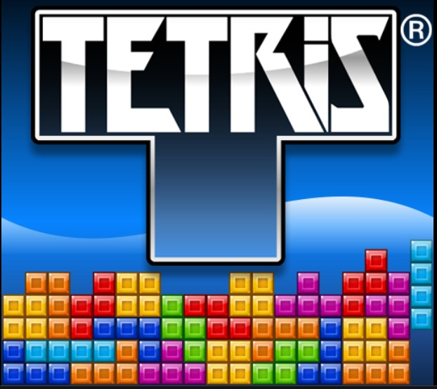

# NUS_ISS_ITSS_Project_GameFace
Graduate Certificate Intelligent Sensing Systems Practice Module Report: PROJECT GAMEFACE

---

## EXECUTIVE SUMMARY
The motivation of our project is to explore using different human physical attributes, like head pose and face actions to implement a vision system that can help people with certain physical disabilities to be able to interact with a computer. Our team conducted research on and experimented with various detection algorithms with the aim of finding a suitable model that can help us achieve this goal. We have also explored various approaches to determine the different head pose and face actions in order to convert these responses into control commands that can be sent via a computer linked to a webcam. After all the experimentation of the various methods, the final system was designed utilizing the landmark tracking based approach - FaceMesh, which is one of the suite of Machine Learning tools from MediaPipe developed by Google. This light weight model was consistently able to help us achieve real-time detection in a fast and accurate way. Finally our team was able to successfully develop a vision system using FaceMesh as its main detection and tracking engine, and also demonstrated the ability for users to have fun with online games simply by moving their head and doing actions with their eyes and mouth.

---

## CREDITS / PROJECT CONTRIBUTION

Team Members: 
Lim Jun Ming 
Kennedy Tadhg 
Yeong Wee Ping

---

### INTRODUCTION

Currently, people living with different physical disabilities need to buy expensive third party peripherals in order to supply inputs to their computer systems and enjoy playing video games. We aim to develop a vision system which will allow Human-Computer Interaction (HCI) in a fun and affordable way, using human gesture and pose recognition.

The input to our proposed system are video images which can be from a simple webcam linked to a computer. We then use a Head Pose tracking model to identify various positions of the head in order to provide real time differentiated responses to send commands to the computer. This allows people who may have difficulties moving their limbs to interact with online games using different head postures simply through a low cost webcam.

---

### CONCLUSIONS
Given the limited time frame for us to work on this project, our team has successfully developed a vision system that is able to detect the various head postures as well as face actions in real-time and provide differentiated control commands to play online games via the use of a simple webcam linked to a computer. During the course of the project, we experimented with different methodologies like detection-based models which can be  2-stage or 1-stage approach, as well as tracking-based models to infer the head angles and even face actions. We had also explored various ways to estimate the different head poses, like directly estimating the angle of tilt via the model, or using heuristic method of calculating euclidean distances from facial landmarks and evaluating the ratio to determine the outcome.

Initially, we started working with the detection-based Head Pose model that directly estimates the face angle. After a series of training and tuning the model, we ultimately managed to obtain very good results but we noticed an obvious reduction in the frames per second since it is doing inference frame by frame. The team then went on to search for an alternative algorithm and managed to find MediaPipe, which is developed by Google, that offers a pipeline of cross platform Machine Learning solutions. It offers a suite of tools that include FaceMesh, which has face detection, landmark detection and tracking . We realised that this can actually perform much faster real-time head pose estimation than the previously mentioned Head Pose model due to speedier inference time. Therefore we selected FaceMesh by MediaPipe as the main engine behind our head pose and face action detection system so that we can deliver a smoother interface and this method of inferring the outcome is also much less complex.

In addition, in order for our system to be able to offer a better gaming experience, and even be versatile enough to play different games, the team has also designed it in such a way that users can adjust various settings according to their own preferences by editing a configuration file.

---

### GAMEFACE SYSTEM DEMO: TETRIS

---

### PROJECT REPORT / PAPER

`Refer to project report for more details on our work at Github Folder: Project Report`

---
### MODEL TRAINING AND EXPERIMENTATIONS

`Refer to files at Github Folder: Experimentation`

---

### INSTALLATION

`Download and run the codes at Github Folder: GameFace_App`

---
